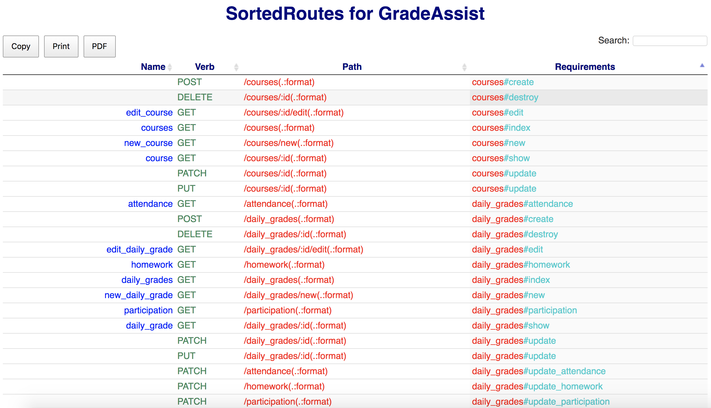

# SortedRoutes

Rails routes in a searchable and sortable table in your browser.



### Installation
Add the gem to the `development:` group of a Rails Gemfile and run `bundle install`.

```
gem 'sorted_routes', '~> 1.0'
```
Link to RubyGems: [SortedRoutes](https://rubygems.org/gems/sorted_routes)

### Usage

```
rake sorted_routes
```
A rake task generates and opens the HTML file `tmp/sorted_routes.html` in your default browser.

### Features

**SortedRoutes** uses the DataTables jQuery plugin to create search and sort functionality.
+ Each column is sortable in ascending or descending order. (Click on arrows next to column header.)
+ Search box in the top-right corner allows user to select rows to view.
+ Routes table can be copied, printed, or saved as a pdf by clicking on buttons in the top-left corner.

### System Dependencies
+ [Launchy](https://github.com/copiousfreetime/launchy) (included in the gem) opens the HTML file
+ [jQuery](https://jquery.com/)
+ [DataTables](https://www.datatables.net/) jQuery plugin is used to generate the tables.

## Author
Created by [Scott Lenander](http://scottlenander.com/)
